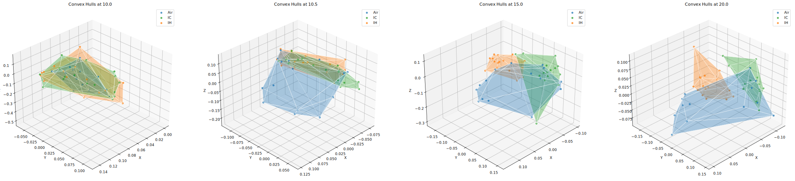

# q2-convexhull2

convexhull2 is a tool for visualizing and calculating dispersion across a set of microbial samples over time through the calculation of a convex hull volume. It produces visualizations that track how group dispersion changes over time, and also how an individual's dispersion changes over time, which can be seen as a meaasure of individual volatility.




### Necessary inputs:
- **Ordination** (or biplot)
- **Metadata**
    - **Column:** grouping column
    - **Column:** numeric time column
    - **Column:** subject id column

### Tutorials

convexhull2 is available within a QIIME2 environment or as a standalone tool. If you are working within a QIIME2 environment, navigate to the QIIME2 tutorial, which uses command line (CLI) commands to generate plots.
- [Standalone tutorial](https://github.com/dpear/q2-convexhull2/blob/main/tutorials/01-ch-visualizations-tutorial.ipynb) 
- [QIIME2 tutorial](https://github.com/dpear/q2-convexhull2/blob/main/tutorials/01-ch-visualizations-tutorial.ipynb)

If starting from a `biom.Table` see the tutorial `01-ch-visualizations-tutorial.ipynb` for how to generate an ordination using RPCA. A working QIIME2 environment is required for this step.

### Installation

Clone this repo and navigate into the directory to install. The `-e` flag will install in edit mode.
```
git clone https://github.com/dpear/q2-convexhull2
cd q2-convexhull2
pip install -e .

```

### Use

convexhull2 is meant to quantify and visualize dispersion over time. However there is also an option to visualize the convex hull over a set of points for a cross-sectional study (i.e. comparing the microbiome of different groups at a single timepoint). This functionality is supported by calling the `hulls-plots-cross-sectional` action instead of the `hulls-plots` action. The `--p-timec` parameter need only be left out. An example call is as follows:
```
qiime convexhull2 hulls-plots-cross-sectional \
    --i-ordination data/rpca-biplot.qza \
    --m-metadata-file data/metadata.tsv \
    --p-groupc 'exposure_type' \
    --p-subjc 'host_subject_id' \
    --o-visualization data/hulls_out_cross_sectional
```