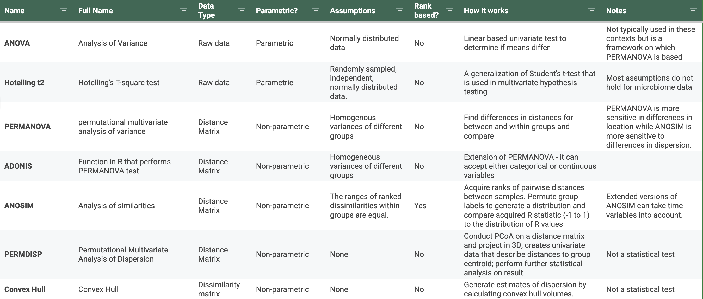

## Summary

q2-convexhull is a package for assessing longitudinal changes in group dispersion in microbiome data over time by calculating convex hull volumes and visualizing them in 3D and quantifying dispersion of individuals over time. It is integrated with the popular QIIME2 microbial data analysis suite (Bolyen et al. 2019), and provides standalone functionality in python. It is applicable to a wide range of data types including a variety of ‘omics, such as microbiome(Song et al. 2021) and metabolome (Boardman 1993), that undergo dimensionality reduction. In this package, 3D hulls are displayed over each group of interest at each timepoint (Figure 1A). A group analysis employs a bootstrapping technique described below to plot the distribution of dispersion of all groups over time **(Figure 1B).** An individual analysis calculates the convex hull volume over a single individual’s multiple time points, and compares these volumes of individuals from different groups **(Figure 1C).**

A sample metadata (.csv file) with column names defining group, individual, and time (optional), as well as an ordination are given as input. Optional parameters include rotation display for 3D plots and 3D axis visibility, along with the ability for a user to define subsampling depth and number of iterations for the bootstrapping step. 
We utilize ConvexHull from scipy (Virtanen et al. 2020) that wraps the Qhull library, which implements the Quickhull algorithm (Barber, Dobkin, and Huhdanpaa 1996) in 3D, a divide and conquer algorithm that works similarly to QuickSort in O(n log n) time. In our package, pandas(McKinney 2010) is used for data manipulation and scikit-bio(citation) is is used for ordination manipulations; seaborn(Waskom 2021) and matplotlib(The Matplotlib Development Team 2024) are used to produce plots.

**Figure 1. ConvexHull output and use cases. A)** 3D plots of convex hulls generated over specified groups. Each frame represents a different time point. **B)** Group convex hull volumes over time. Each point represents the volume calculated from a single subsampling iteration. **C)** Convex hull volumes calculated for an individual over time. **D)** Data from Song et. al. showing how an infant’s oral microbiome tends towards a vaginally born state when seeding is performed (Song et al. 2021).

## Statement of Need

The human microbiome is a collection of all microorganisms, such as bacteria, fungi, and viruses, living on and inside the human body, and is important to study because it plays a significant role in health and disease, and has been implicated in everything from immune system development to mental health disorders and autism (Zheng, Liwinski, and Elinav 2020) (Nguyen et al. 2021) (Morton et al. 2023). Quantifying how such a highly dynamic community changes over time and between environments is challenging. One way of doing so is measuring beta diversity, which describes how similar or different the microbiome is between samples or environments. One way beta diversity is evaluated is by calculating metrics such as Bray-Curtis dissimilarity, UniFrac distance, or RPCA (Lozupone and Knight 2005; Martino et al. 2019). Each uniquely compare and transform the abundances and presence of microbes shared between two samples to obtain pairwise distances between all samples in a given dataset. These distance matrices are then commonly dimensionally reduced (PCoA, PCA, NMDS, etc.) to describe microbial communities in human-interpretable lower dimensional space. In this space, a single point indicates all microbial data associated with a sample. With decreased costs of sequencing and a push for more longitudinal studies in the field, current methods of visualizing and quantifying these results are lacking in that no single metric provides descriptive statistics paired with meaningful visualizations to describe dispersion between groups over time.

Hotelling t-squared statistics and associated plots are commonly used in microbiome analyses  (Koeth et al. 2013) because it is a multivariate test to determine differences between multiple dependent variables. Ellipses drawn around a group centroid can provide a visual representation of the data's variance, or dispersion, in multidimensional space. Though the test is based on the assumptions that do not hold for microbiome data **(Table 1).** Thus, the field is currently lacking a measure that can both calculate and visualize non-parametric distributed multivariate data.

**Table 1. Statistical tests and metrics for assessing group differences.**

Other analyses of dissimilarity matrices include but are not limited to the statistical frameworks of PERMANOVA, ANOSIM, as well as supporting calculations and packages **(Table 1).** Permutational multivariate analysis of variance (PERMANVOA) assesses whether dissimilarity between groups is significantly greater than the average dissimilarity within groups, and is performed directly on a distance matrix. More simply it answers the questions of if the centroids of groups are separate from each other in multidimensional space. It makes no such assumptions of normality and is thus better suited for microbiome data, however does assume groups have homogeneous variances, which is likely not the case, especially when comparing microbiomes of different host environments. Additionally, PERMANOVA does not by default take into account the fact that some samples come from the same individual at different time points and are thus not independent. Implementations of PERMANOVA such as the adonis function in R may give as readout, the statistical significance of a group-time interaction term to define whether or not groups differ over time, a generalized and non-specific p-value and test statistic that lacks a meaningful visual interpretation.

Prior to conducting a PERMANOVA, a PERMDISP framework (Anderson, Ellingsen, and McArdle 2006) is commonly employed in order to confirm that group variances are homogeneous (the assumption of a PERMANOVA test). A non-significant result from PERMDISP indicates that groups do not differ in dispersion and that therefore the differences are entirely due to differences in location. ANOSIM (n.d.) is another similar statistical test commonly used that is instead based on ranked differences in distances, rather than the distances themselves.

In order to supersede the quality of visualizations provided by Hotelling t-squared ellipses and properly non-parametrically measure and visualize the dispersion of different groups over time, we propose calculating convex hull volumes. We have previously used convex hull volumes to quantify  how vaginal seeding enables a c-section born infant’s microbiome to trend towards a healthier state more closely resembling that of its mother (Song et al. 2021) **(Figure 1D).**

A convex hull is a geometric figure defined by the smallest convex polygon that contains all given points in multidimensional space. In simpler terms the hull can be thought of as stretching plastic wrap around a 3D set of points. The convex hull describes the boundary within which all points lie, and the volume of the resulting figure thus serves as a measure of dispersion. Higher volumes indicate more dispersion while lower volumes indicate more homogeneity. Volumes as a standalone value are relatively arbitrary because they are dependent on the scale of the 3D axes on which the points are projected. This can be especially important with datasets that contain a longitudinal sampling component. Biologists may want to know if groups are becoming more or less variable over time.

If we have groups (i.e. treatment vs. control) that stratify our data, we can look at a single time point and consider all the samples from different individuals from different groups. For each group, a convex hull is calculated and the resulting volume can be interpreted as dispersion within a group. In practice, this volume is highly sensitive to outliers because if all of our points are tightly clustered and a single point is very distant, the volume of the resultant hull encapsulating these points will be misleadingly high. Similarly, groups with more samples will, by chance, have a higher volume. To account for this, we employ a subsampling technique based on bootstrapping. Points within each group are subsampled iteratively to generate an empirical distribution of group hull volume at a given time.

Overall we have created a tool that applies a previously used and accepted mathematical concept to describe dispersion within a microbiome dataset and created informative data visualizations, and made the tool available as standalone software and as a QIIME2 integrated plugin.

# Acknowledgments
TODO

# References
TODO
