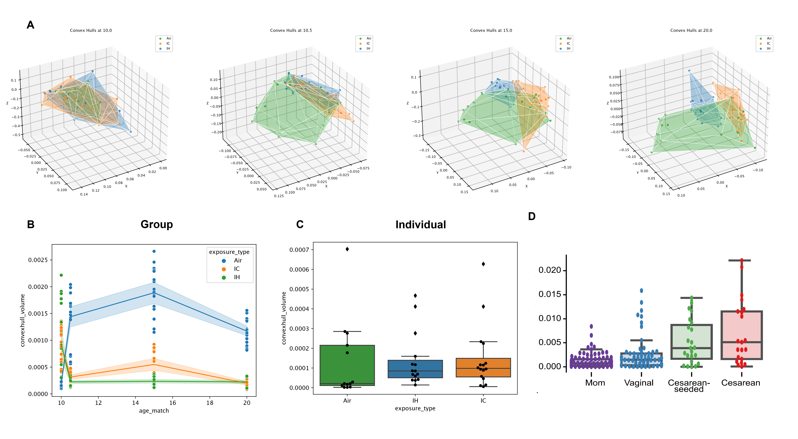

### Statement of Need

The human microbiome is a collection of all microorganisms, such as bacteria, fungi, and viruses, living on and inside the human body, and is important to study because it plays a significant role in health and disease, and has been implicated in everything from immune system development to mental health disorders [ref] [ref]. Quantifying how such a highly dynamic community changes over time and between environments is challenging. One way of doing so is measuring beta diversity, which describes how similar or different the microbiome is between samples or environments. It is calculated using one of many metrics such as Bray-Curtis dissimilarity, UniFrac distance, RPCA, which all compare and transform, in different ways, the abundances and presence of microbes shared between two samples to obtain pairwise distances between all samples in a given dataset. These distance matrices are then commonly dimensionally reduced to describe microbial communities present in a sample in lower dimensional space. With decreased costs of sequencing and a push for more longitudinal studies in the field, current methods of visualizing and quantifying these results are lacking in that no single metric provides descriptive statistics paired with meaningful visualizations to describe dispersion between groups over time.

Hotelling t-squared statistics and associated plots are commonly used in microbiome analyses [ref] [ref] [ref] because it is a multivariate test to determine differences between multiple dependent variables. Ellipses drawn around a group mean are derived from eigenvalues and eigenvectors of the covariance matrix, and can provide a visual representation of the data's variance, or dispersion, in multidimensional space. The test is based on the assumption that each sample follows a multivariate normal distribution, which does not hold for microbiome data.

PERMANOVA assesses whether dissimilarity between groups is significantly greater than the average dissimilarity within groups, and acts on a distance matrix. It makes no such assumptions of normality and is thus well suited for microbiome data. However, when calculating PERMANOVA over multiple time points, an adonis test would be appropriate, which gives as readout, the statistical significance of a group-time interaction term to define whether or not the groups are different over time. Aside from plotting groups in 3D, no additional visualizations are possible when performing these tests.
In order to supersede the quality of visualizations provided by Hotelling t-squared ellipses and properly non-parametrically measure and visualize the dispersion of different groups over time, we propose calculating convex hull volumes.

A convex hull is a geometric figure defined by the smallest convex polygon that contains all given points in multidimensional space. In simpler terms the hull can be thought of as wrapping a 3D set of points in saran wrap. The convex hull describes the boundary within which all points lie, and the volume of the resulting figure thus serves as a measure of dispersion. Volumes as a standalone value are relatively arbitrary because they are dependent on the scale of the 3D axes on which the points are projected, however, when compared, they can describe relative dispersion within in a dataset.

In our context, a point in 3D space represents an individual sample, specifically, a dimensionally reduced microbial community profile of an individual at a given time point. When samples are taken from the same individual longitudinally, we often have questions about how stable an individual’s microbiome is over time. By calculating the convex hull volume over an individual’s set of points, we can quantify their dispersion over time. 
Similarly, if we have groups (i.e. treatment vs. control) that stratify our data, we can look at a single time point and consider all the samples from different individuals from different groups. For each group, a convex hull is calculated and the resulting volume can be interpreted as dispersion within a group. In practice, this volume is highly sensitive to outliers because if all of our points are tightly clustered and a single point is very distant, the volume of the resultant hull encapsulating these points will be misleadingly high. Similarly, groups with more samples will, by chance, have a higher volume. To account for this, we employ a subsampling technique based on bootstrapping. Points within each group are subsampled iteratively to generate an empirical distribution of hull volume at a given time.

### Summary

q2-convexhull is a package that is both integrated with the popular QIIME2 microbial data analysis suite, and provides standalone functionality, for calculating convex hull volumes over time and visualizing them in 3D, tracking changes in group dispersion over time, and quantifying dispersion of individuals over time. 3D hulls are displayed over each group of interest at each timepoint **(Figure 1a)**. A group analysis employed the above mentioned bootstrapping technique to plot the distribution of dispersion of all groups over time **(Figure 1b)**. An individual analysis calculates the convex hull volume over a single individual’s multiple time points, and compares these volumes of individuals with different group membership **(Figure 1c)**.

A sample metadata (.csv file) and column names defining group, individual, and time (optional) are given as input. Optional parameters include rotation display for 3D plots and 3D axis visibility, along with the ability for a user to define subsampling depth and number of iterations for the bootstrapping step. 
Scipy.spatial uses the Qhull library, which implements the Quickhull algorithm (Barber et al. 1996) in 3D, a divide and conquer algorithm that works similarly to QuickSort in O(n log n) time.

We utilize ConvexHull from scipy.spatial that wraps the Qhull library, which implements the Quickhull algorithm (Barber et al. 1996) in 3D, a divide and conquer algorithm that works similarly to QuickSort in O(n log n) time. pandas [ref] is used for data manipulation and seaborn [ref] and matplotlib [ref] are used to produce plots.

# Acknowledgments
TODO

# References
TODO